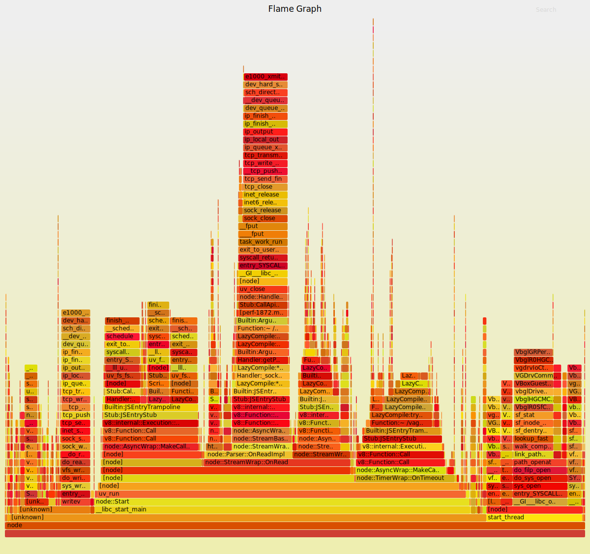

## Vagrant environment for profiling nodejs apps

Add `vagrant/settings.json` (example at `vagrant/settings.json.example`)

Setup repos:
  ` ./scripts/setup.sh`

Start server:
  ` ./scripts/start_server.sh`

Start perf:
  ` ./scripts/start_perf.sh`

start_perf.sh will output a SVG that you can open in your web browser.

## FlameGraph example

